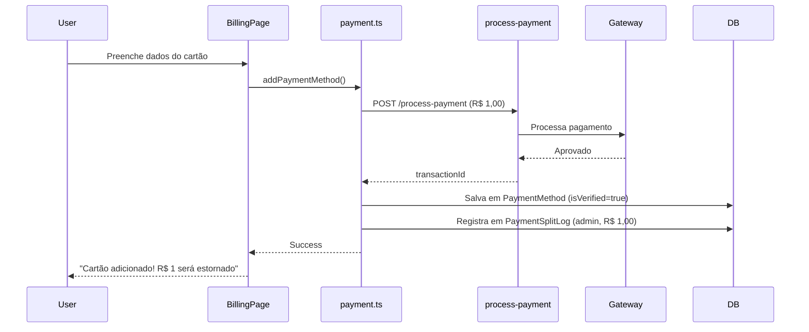
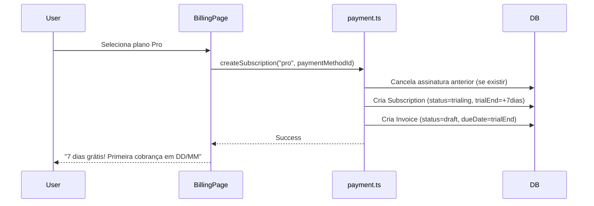
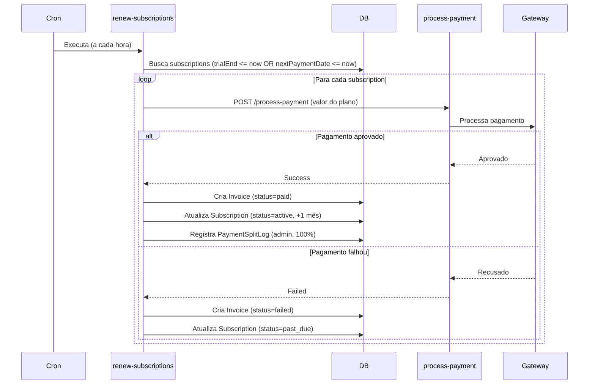

# Sistema de Faturamento SyncAds

Documentação completa do sistema de faturamento integrado ao Split de Pagamento multi-gateway.

## 📋 Índice

- [Visão Geral](#visão-geral)
- [Arquitetura](#arquitetura)
- [Planos Disponíveis](#planos-disponíveis)
- [Tabelas do Banco de Dados](#tabelas-do-banco-de-dados)
- [API de Pagamentos](#api-de-pagamentos)
- [Edge Functions](#edge-functions)
- [Fluxo de Funcionamento](#fluxo-de-funcionamento)
- [Configuração](#configuração)
- [Testando o Sistema](#testando-o-sistema)

---

## 🎯 Visão Geral

O sistema de faturamento do SyncAds oferece:

- **4 Planos**: Free, Starter, Pro e Enterprise
- **Trial de 7 dias** para planos pagos
- **Verificação de cartão** com cobrança de R$ 1,00 (estornado em 24h)
- **Renovação automática** após o período de trial
- **Integração total** com o sistema de Split de Pagamento multi-gateway
- **Logs de auditoria** em PaymentSplitLog
- **Histórico de faturas** completo

### Características Principais

✅ Multi-gateway através do Split de Pagamento  
✅ 100% das cobranças de assinatura vão para o gateway do admin (SyncAds)  
✅ Verificação de cartão segura com estorno automático  
✅ Trial de 7 dias sem cobrança  
✅ Renovação automática mensal  
✅ Gestão completa de métodos de pagamento  
✅ Histórico e download de faturas  

---

## 🏗️ Arquitetura

### Integração com Split de Pagamento

Todas as cobranças de faturamento são processadas através do sistema de Split de Pagamento existente:

```
┌─────────────────────────────────────────────────────────────┐
│                    BILLING SYSTEM                            │
│                                                               │
│  ┌──────────────┐      ┌──────────────┐      ┌───────────┐ │
│  │ BillingPage  │─────▶│ payment.ts   │─────▶│ Supabase  │ │
│  │   (UI)       │      │   (API)      │      │  Tables   │ │
│  └──────────────┘      └──────────────┘      └───────────┘ │
│         │                      │                             │
│         │                      ▼                             │
│         │         ┌──────────────────────────┐              │
│         └────────▶│ process-payment          │              │
│                   │   (Edge Function)        │              │
│                   └──────────────────────────┘              │
│                              │                               │
└──────────────────────────────┼───────────────────────────────┘
                               │
                               ▼
┌─────────────────────────────────────────────────────────────┐
│              PAYMENT SPLIT SYSTEM                            │
│                                                               │
│  ┌──────────────────┐        ┌──────────────────┐          │
│  │  GatewayConfig   │◀──────│ PaymentSplitLog  │          │
│  │  (Admin Gateway) │        │  (decision='admin')│          │
│  └──────────────────┘        └──────────────────┘          │
│         │                                                    │
│         ▼                                                    │
│  ┌──────────────────────────────────────────┐              │
│  │   Multi-Gateway Support                   │              │
│  │  • Mercado Pago  • Stripe  • PagSeguro   │              │
│  │  • PayPal • Asaas • +50 outros gateways  │              │
│  └──────────────────────────────────────────┘              │
└─────────────────────────────────────────────────────────────┘
```

### Componentes

1. **Frontend** (`BillingPage.tsx`): Interface de usuário
2. **API** (`payment.ts`): Funções client-side
3. **Edge Function** (`process-payment`): Processamento de pagamentos
4. **Edge Function** (`renew-subscriptions`): Renovação automática
5. **Banco de Dados**: PaymentMethod, Subscription, Invoice
6. **Split System**: GatewayConfig, PaymentSplitLog

---

## 💎 Planos Disponíveis

### Free
- **Preço**: Grátis
- **IA**: 5 mensagens/dia, 2 imagens/dia
- **Limites**: 1 checkout, 100 produtos
- **Taxa**: 2.5% por transação

### Starter
- **Preço**: R$ 49,90/mês
- **Trial**: 7 dias grátis
- **IA**: 50 mensagens/dia, 20 imagens/dia
- **Limites**: 5 checkouts, 1.000 produtos
- **Taxa**: 1.5% por transação
- **Extras**: Suporte prioritário, Analytics básico

### Pro (POPULAR)
- **Preço**: R$ 149,90/mês
- **Trial**: 7 dias grátis
- **IA**: 200 mensagens/dia, 100 imagens/dia
- **Limites**: 20 checkouts, 10.000 produtos
- **Taxa**: 1% por transação
- **Extras**: Suporte 24/7, Analytics avançado, Domínio custom, API

### Enterprise
- **Preço**: R$ 499,90/mês
- **Trial**: 7 dias grátis
- **IA**: Ilimitado
- **Limites**: Ilimitado
- **Taxa**: 0.5% por transação
- **Extras**: Suporte dedicado, BI, White label, Gerente de conta

---

## 🗄️ Tabelas do Banco de Dados

### PaymentMethod
Armazena métodos de pagamento dos usuários.

```sql
CREATE TABLE "PaymentMethod" (
  id UUID PRIMARY KEY,
  userId TEXT REFERENCES "User"(id),
  type TEXT CHECK (type IN ('credit_card', 'debit_card')),
  cardBrand TEXT,
  lastFourDigits TEXT,
  expiryMonth TEXT,
  expiryYear TEXT,
  cardholderName TEXT,
  isDefault BOOLEAN DEFAULT false,
  isVerified BOOLEAN DEFAULT false,
  gatewayToken TEXT,
  gatewayCustomerId TEXT,
  createdAt TIMESTAMP DEFAULT NOW(),
  updatedAt TIMESTAMP DEFAULT NOW()
);
```

### Subscription
Gerencia assinaturas dos usuários.

```sql
CREATE TABLE "Subscription" (
  id UUID PRIMARY KEY,
  userId TEXT REFERENCES "User"(id),
  plan TEXT CHECK (plan IN ('free', 'starter', 'pro', 'enterprise')),
  status TEXT CHECK (status IN ('trialing', 'active', 'past_due', 'canceled', 'paused')),
  currentPeriodStart TIMESTAMP,
  currentPeriodEnd TIMESTAMP,
  trialEnd TIMESTAMP,
  cancelAtPeriodEnd BOOLEAN DEFAULT false,
  paymentMethodId UUID REFERENCES "PaymentMethod"(id),
  lastPaymentDate TIMESTAMP,
  nextPaymentDate TIMESTAMP,
  amount DECIMAL(10,2),
  createdAt TIMESTAMP DEFAULT NOW(),
  updatedAt TIMESTAMP DEFAULT NOW()
);
```

### Invoice
Histórico de faturas.

```sql
CREATE TABLE "Invoice" (
  id UUID PRIMARY KEY,
  userId TEXT REFERENCES "User"(id),
  subscriptionId UUID REFERENCES "Subscription"(id),
  amount DECIMAL(10,2),
  status TEXT CHECK (status IN ('draft', 'pending', 'paid', 'failed', 'refunded')),
  description TEXT,
  dueDate TIMESTAMP,
  paidAt TIMESTAMP,
  paymentMethodId UUID REFERENCES "PaymentMethod"(id),
  transactionId UUID,
  metadata JSONB,
  createdAt TIMESTAMP DEFAULT NOW(),
  updatedAt TIMESTAMP DEFAULT NOW()
);
```

---

## 🔌 API de Pagamentos

Arquivo: `src/lib/api/payment.ts`

### Métodos de Pagamento

#### `addPaymentMethod(request: AddPaymentMethodRequest)`
Adiciona um novo cartão com verificação de R$ 1,00.

```typescript
const result = await addPaymentMethod({
  cardNumber: "1234567890123456",
  cardholderName: "JOAO SILVA",
  expiryMonth: "12",
  expiryYear: "2025",
  cvv: "123",
  cpf: "12345678900"
});
```

**Fluxo:**
1. Valida dados do cartão
2. Processa cobrança de R$ 1,00 via gateway admin
3. Salva cartão no banco (isVerified=true)
4. Registra em PaymentSplitLog (decision='admin')
5. Agenda estorno automático (TODO)

#### `listPaymentMethods()`
Lista todos os cartões do usuário.

#### `removePaymentMethod(paymentMethodId: string)`
Remove um cartão (valida se não está em uso por assinatura ativa).

#### `setDefaultPaymentMethod(paymentMethodId: string)`
Define um cartão como padrão.

### Assinaturas

#### `createSubscription(plan: string, paymentMethodId: string)`
Cria uma nova assinatura com trial de 7 dias.

```typescript
const result = await createSubscription("pro", paymentMethodId);
```

**Fluxo:**
1. Valida método de pagamento
2. Cancela assinatura anterior se existir
3. Cria assinatura com status='trialing'
4. Define trialEnd = +7 dias
5. Cria invoice draft para primeiro pagamento

#### `getCurrentSubscription()`
Retorna a assinatura ativa do usuário.

#### `cancelSubscription(subscriptionId: string, immediate: boolean)`
Cancela assinatura (immediate=true cancela imediatamente).

#### `reactivateSubscription(subscriptionId: string)`
Reativa uma assinatura cancelada.

### Faturas

#### `listInvoices()`
Lista todas as faturas do usuário.

#### `getInvoice(invoiceId: string)`
Busca uma fatura específica.

### Processamento

#### `processSubscriptionPayment(subscriptionId: string)`
Processa pagamento de renovação de assinatura.

**Usado pela Edge Function `renew-subscriptions`**

---

## ⚡ Edge Functions

### 1. process-payment
**Caminho**: `supabase/functions/process-payment/index.ts`

Processa todos os pagamentos através do sistema de Split multi-gateway.

**Uso no Billing:**
- Verificação de cartão (R$ 1,00)
- Renovação de assinaturas

**Características:**
- Auto-detecção de gateway
- Suporte a 50+ gateways
- Rate limiting
- Retry logic
- Logs detalhados

### 2. renew-subscriptions
**Caminho**: `supabase/functions/renew-subscriptions/index.ts`

Processa renovações automáticas de assinaturas.

**Executado via Cron (recomendado: a cada hora)**

**Funcionalidade:**
1. Busca assinaturas com trial expirado ou período de renovação
2. Processa pagamento via process-payment
3. Cria invoice (paid ou failed)
4. Atualiza assinatura (active ou past_due)
5. Registra em PaymentSplitLog

**Configurar Cron:**
```bash
# No Supabase Dashboard > Edge Functions > Cron
# Schedule: 0 * * * * (a cada hora)
# Function: renew-subscriptions
```

---

## 🔄 Fluxo de Funcionamento

### 1. Adicionar Cartão



### 2. Criar Assinatura com Trial



### 3. Renovação Automática



---

## ⚙️ Configuração

### 1. Gateway Administrativo

O sistema requer um gateway configurado com `userId IS NULL` e `isDefault = true`.

**Verificar no Supabase:**
```sql
SELECT * FROM "GatewayConfig"
WHERE "userId" IS NULL
  AND "isDefault" = true
  AND "isActive" = true;
```

Se não existir, criar via painel `/super-admin/payment-split`.

### 2. Variáveis de Ambiente

No Supabase Dashboard > Settings > Edge Functions:

```env
SUPABASE_URL=https://ovskepqggmxlfckxqgbr.supabase.co
SUPABASE_ANON_KEY=eyJhbG...
SUPABASE_SERVICE_ROLE_KEY=eyJhbG...
```

### 3. Deploy Edge Functions

```bash
# Deploy process-payment (se ainda não estiver)
supabase functions deploy process-payment

# Deploy renew-subscriptions
supabase functions deploy renew-subscriptions
```

### 4. Configurar Cron

No Supabase Dashboard:
1. Edge Functions > Cron Jobs
2. Create new cron job
3. Function: `renew-subscriptions`
4. Schedule: `0 * * * *` (a cada hora)
5. Save

---

## 🧪 Testando o Sistema

### 1. Testar Adição de Cartão

```typescript
// No console do navegador (página /billing)
import { addPaymentMethod } from '@/lib/api/payment';

const result = await addPaymentMethod({
  cardNumber: "4111111111111111", // Visa test
  cardholderName: "TESTE USUARIO",
  expiryMonth: "12",
  expiryYear: "2025",
  cvv: "123",
  cpf: "12345678900"
});

console.log(result);
```

**Verificar:**
- ✅ Cartão salvo em `PaymentMethod`
- ✅ Transação em `Transaction` (R$ 1,00)
- ✅ Log em `PaymentSplitLog` (decision='admin', amount=1.00)

### 2. Testar Criação de Assinatura

```typescript
import { createSubscription, listPaymentMethods } from '@/lib/api/payment';

const methods = await listPaymentMethods();
const result = await createSubscription("starter", methods[0].id);

console.log(result);
```

**Verificar:**
- ✅ Assinatura criada com status='trialing'
- ✅ trialEnd = +7 dias
- ✅ Invoice draft criada

### 3. Testar Renovação Manual

```bash
# Chamar a Edge Function diretamente
curl -X POST \
  https://ovskepqggmxlfckxqgbr.supabase.co/functions/v1/renew-subscriptions \
  -H "Authorization: Bearer $SUPABASE_SERVICE_ROLE_KEY" \
  -H "Content-Type: application/json"
```

**Verificar:**
- ✅ Assinaturas processadas
- ✅ Invoices criadas
- ✅ Subscriptions atualizadas
- ✅ PaymentSplitLog registrado

### 4. Simular Trial Expirado

```sql
-- No SQL Editor do Supabase
UPDATE "Subscription"
SET "trialEnd" = NOW() - INTERVAL '1 day'
WHERE "userId" = 'seu-user-id'
  AND status = 'trialing';
```

Depois execute o renew-subscriptions e veja a renovação acontecer.

---

## 📊 Monitoramento

### Logs de Split

Todas as cobranças de billing são registradas:

```sql
SELECT
  "createdAt",
  decision,
  amount,
  "adminRevenue",
  "gatewayName",
  reason,
  metadata
FROM "PaymentSplitLog"
WHERE "ruleType" = 'admin_billing'
ORDER BY "createdAt" DESC;
```

### Estatísticas de Assinaturas

```sql
SELECT
  plan,
  status,
  COUNT(*) as count,
  SUM(amount) as total_revenue
FROM "Subscription"
GROUP BY plan, status;
```

### Taxas de Conversão

```sql
SELECT
  COUNT(*) FILTER (WHERE status = 'trialing') as trials,
  COUNT(*) FILTER (WHERE status = 'active') as active,
  COUNT(*) FILTER (WHERE status = 'canceled') as canceled,
  ROUND(
    100.0 * COUNT(*) FILTER (WHERE status = 'active') /
    NULLIF(COUNT(*) FILTER (WHERE status IN ('trialing', 'active', 'canceled')), 0),
    2
  ) as conversion_rate
FROM "Subscription";
```

---

## 🔒 Segurança

1. **Tokenização**: Cartões não são armazenados, apenas tokens do gateway
2. **Criptografia**: Dados sensíveis criptografados em trânsito e repouso
3. **Rate Limiting**: Limite de tentativas de pagamento (process-payment)
4. **Audit Log**: Todas as transações em PaymentSplitLog
5. **Service Role**: Edge Functions usam service role key
6. **Validação**: Validação client e server-side

---

## 🚀 Próximos Passos

- [ ] Implementar estorno automático do R$ 1,00
- [ ] Adicionar webhook de gateway para atualização em tempo real
- [ ] Implementar retry automático para pagamentos falhados
- [ ] Adicionar notificações por email (renovação, falha, etc)
- [ ] Criar dashboard de métricas de faturamento
- [ ] Implementar downgrade de planos
- [ ] Adicionar cupons de desconto
- [ ] Gerar PDF de faturas

---

## 📞 Suporte

Para dúvidas ou problemas:
- Verificar logs no Supabase Dashboard > Edge Functions
- Consultar PaymentSplitLog para auditoria
- Verificar status de assinaturas e faturas

---

**Última atualização**: 2025-02-04
**Versão**: 1.0.0