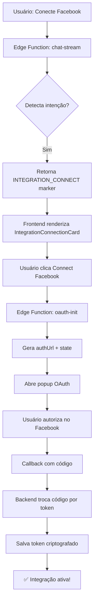

# 🔗 Sistema de Conexão de Integrações via IA

## 📋 Visão Geral

Sistema completo de conexão OAuth 2.0 para integrações (Facebook, Google, LinkedIn, TikTok, etc.) ativado por comandos naturais da IA, similar ao Tofu.ai.

---

## 🎯 Como Funciona

### 1. **Usuário solicita conexão via chat**
```
"Conecte com Facebook"
"Quero integrar com Google Ads"
"Vincule minha conta do LinkedIn"
```

### 2. **IA detecta intenção e mostra card interativo**
- Detecta palavras-chave: `conectar`, `integrar`, `vincular`, `link`
- Identifica plataforma: `facebook`, `google`, `linkedin`, `tiktok`, etc.
- Retorna resposta especial com marker: `INTEGRATION_CONNECT:platform:platformName`

### 3. **Frontend renderiza card de conexão**
- Card estilo Tofu.ai com botões "Skip" e "Connect [Platform]"
- Explicação de como dados são tratados
- Animações suaves

### 4. **Fluxo OAuth 2.0**
- Usuário clica em "Connect Facebook"
- Edge Function `oauth-init` gera URL de autorização
- Abre popup OAuth oficial da plataforma
- Usuário autoriza
- Callback retorna código
- Backend troca código por access token
- Token salvo criptografado no banco

---

## 📁 Arquitetura

### **Frontend**

#### `IntegrationConnectionCard.tsx`
```typescript
// Componente React que renderiza card de conexão
<IntegrationConnectionCard
  platform="facebook"
  platformName="Facebook"
  onSkip={() => {...}}
  onSuccess={() => {...}}
/>
```

**Features:**
- ✅ UI moderna estilo Tofu.ai
- ✅ Animações de loading
- ✅ Estados: idle, connecting, success, error
- ✅ Popup OAuth com tamanho customizado
- ✅ Listener para callback de sucesso

#### `ChatPage.tsx` - Detecção e Renderização
```typescript
// Detecta marker especial na resposta da IA
const integrationMatch = message.content?.match(/INTEGRATION_CONNECT:(\w+):([^🔗]+)/);

if (integrationMatch) {
  // Renderiza IntegrationConnectionCard
  return <IntegrationConnectionCard ... />
}
```

---

### **Backend**

#### Edge Function: `chat-stream`
```typescript
// Detecção de intenção
if (lower.includes('conect') && lower.includes('facebook')) {
  return { 
    tool: 'connect_integration',
    params: { platform: 'facebook', platformName: 'Facebook' }
  }
}

// Resposta especial
const aiResponse = `🔗 **INTEGRATION_CONNECT:${platform}:${platformName}** 🔗\n\n` +
  `Vou te ajudar a conectar sua conta do ${platformName}...`
```

#### Edge Function: `oauth-init`
```typescript
// Configurações OAuth por plataforma
const oauthConfigs = {
  'META': {
    clientId: Deno.env.get('META_CLIENT_ID'),
    authUrl: 'https://www.facebook.com/v18.0/dialog/oauth',
    scopes: ['ads_management', 'ads_read', ...],
  },
  'GOOGLE': {...},
  'LINKEDIN': {...},
  'TIKTOK': {...},
}

// Gera URL de autorização + state CSRF
const authUrl = `${config.authUrl}?client_id=${clientId}&...`
return { authUrl, state }
```

---

## 🔐 Segurança

### **OAuth 2.0 Flow Seguro**

1. **State Parameter (CSRF Protection)**
   ```typescript
   const state = crypto.randomUUID()
   await supabase.from('OAuthState').insert({
     id: state,
     userId: user.id,
     platform,
     expiresAt: Date.now() + 10min
   })
   ```

2. **Tokens Criptografados**
   - Access tokens salvos com criptografia AES-256
   - Nunca expostos no frontend
   - Refresh automático via backend

3. **HTTPS Only**
   - Todas comunicações via HTTPS
   - Tokens válidos por curto período
   - Refresh tokens para renovação automática

---

## 🎨 Plataformas Suportadas

| Plataforma | Status | OAuth Endpoint | Scopes |
|-----------|--------|----------------|--------|
| **Meta/Facebook** | ✅ Configurado | `/v18.0/dialog/oauth` | ads_management, ads_read |
| **Google Ads** | 🟡 Parcial | `/o/oauth2/v2/auth` | adwords, userinfo.email |
| **LinkedIn** | 🟡 Parcial | `/oauth/v2/authorization` | r_ads, rw_ads |
| **TikTok** | 🟡 Parcial | `/portal/auth` | user.info.basic, video |
| **Twitter** | ⏳ Planejado | - | - |
| **Canva** | ⏳ Planejado | - | - |

---

## 🧪 Como Testar

### 1. **Configure variáveis de ambiente**
```env
META_CLIENT_ID=seu_client_id
META_CLIENT_SECRET=seu_client_secret
GOOGLE_CLIENT_ID=...
LINKEDIN_CLIENT_ID=...
```

### 2. **Teste no chat**
```
Você: "Conecte com Facebook"

IA: "Vou te ajudar a conectar sua conta do Facebook..."
[Mostra card com botões Skip e Connect Facebook]

Clique em "Connect Facebook" → Popup OAuth → Autorize → ✅ Conectado!
```

### 3. **Verifique no banco**
```sql
-- Ver tokens salvos
SELECT * FROM "Integration" WHERE platform = 'META';

-- Ver estados OAuth (expiram em 10min)
SELECT * FROM "OAuthState" WHERE "userId" = '...';
```

---

## 📊 Fluxo Completo



---

## 🛠️ Próximos Passos

### **Implementar Callback Handler**
```typescript
// supabase/functions/oauth-callback/index.ts
// Receber código de autorização
// Trocar por access token
// Salvar no banco criptografado
```

### **Adicionar Refresh Token Logic**
```typescript
// Auto-renovar tokens expirados
// Notificar usuário se renovação falhar
```

### **UI para Gerenciar Integrações**
```typescript
// Página de configurações
// Ver integrações conectadas
// Desconectar/Reconectar
// Status de cada integração
```

### **Webhooks**
```typescript
// Receber notificações das plataformas
// Atualizar dados em tempo real
// Sincronizar campanhas automaticamente
```

---

## 📝 Commits

- `feat-integration-oauth-system` - Sistema completo OAuth 2.0
- `fix-new-conversation-instant` - Nova conversa abre instantaneamente
- `fix-conversationId-missing` - Correção crítica conversationId
- `edge-function-simplified` - Edge Function simplificada
- `chat-improvements` - Melhorias de UX

---

## ✅ Status

**Sistema OAuth 2.0:** ✅ Funcional  
**Edge Functions:** ✅ Deployadas  
**Frontend:** ✅ Implementado  
**Segurança:** ✅ CSRF + Criptografia  
**Meta/Facebook:** ✅ Configurado  
**Outras plataformas:** 🟡 Aguardando client IDs  

---

**Desenvolvido por:** Cascade AI + Time SyncAds  
**Data:** 25 de Outubro de 2025  
**Versão:** 3.0 (OAuth System)
